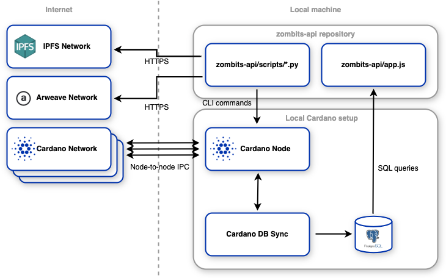
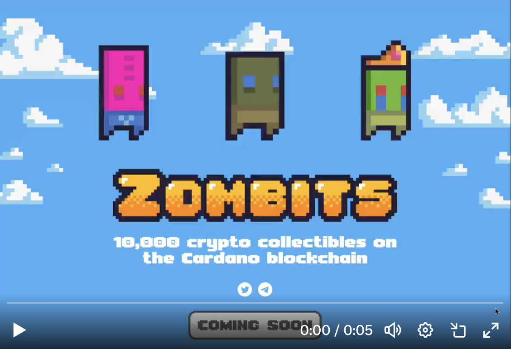
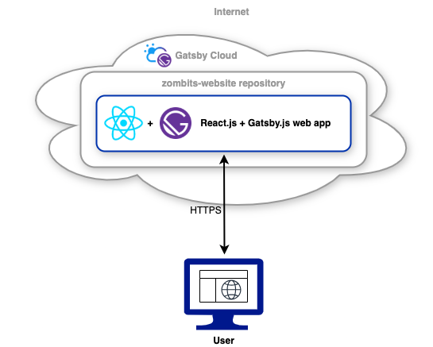
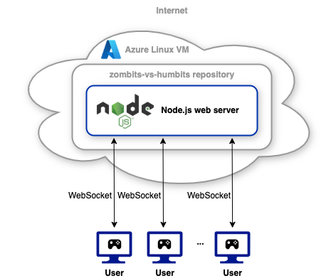

# Zombits Project

## Background

In my free time as a side-hustle, I created and led the development of a blockchain-based gaming platform built on the Cardano blockchain, with the help of technologies such as Microsoft Azure and Node.js.

I targeted this project towards Cardano, because it was very new in the NFT space at the time, and this would provide a great business opportunity. However, since Cardano was very new, this also meant a lack of developer resources, and no established NFT marketplaces or minting software. So in order to overcome this problem, I had utilised countless hours of research to understand how Cardano works, what parts the ecosystem is made up of, how transactions are stored and distributed, and how to write and submit transactions to the Cardano blockchain (particularly to mint NFTs).

The project then slowly evolved into a gaming platform, allowing users to play an online multiplayer game with their digital assets.

This gaming platform amassed around 10,000 users and was later acquired.

## Overview

This project consists of the following 3 main components:

1. [zombits-api](https://github.com/ZombitsNFT/zombits-api): Minting Software
   - Software used to interact with the Cardano blockchain to mint NFTs. Used for submitting transactions to the Cardano blockchain, retrieving information (such as transactions, payment amounts, etc.) from the Cardano blockchain, as well as interacting with other third-party distributed services, namely [IPFS](https://ipfs.tech/) and [Arweave](https://www.arweave.org/).
2. [zombits-website](https://github.com/ZombitsNFT/zombits-website): Interactive Website
   - Promotional Zombits website, built with Gatsby.js and React.js, where users were able to explore the Zombits NFT collection, and search and filter by NFT attributes. Hosted on Gatsby Cloud.
3. [zombits-vs-humbits](https://github.com/ZombitsNFT/zombits-vs-humbits): Multiplayer Online Game
   - Gaming platform where users could connect their digital wallets to play in a virtual online world with their Zombits NFTs. Built with Node.js, using WebSockets ([Socket.IO](https://socket.io/)) for two-way communication. Hosted on Microsoft Azure.

## 1. Minting Software ([zombits-api](https://github.com/ZombitsNFT/zombits-api))

### Overview

This software was hosted on a local machine, and is composed of the following main sections:

- [zombits-api/scripts](https://github.com/ZombitsNFT/zombits-api/tree/main/scripts)
  - Writes and submits transactions to the Cardano network (useful for minting NFTs) by wrapping the [Cardano CLI](https://github.com/IntersectMBO/cardano-node).
  - Stores NFTs and related data on [IPFS](https://ipfs.tech/) and [Arweave](https://www.arweave.org/), to add an extra layer of data backup and integrity.
- [zombits-api/app.js](https://github.com/ZombitsNFT/zombits-api/blob/main/app.js)
  - Exposes an API to interact with the blockchain node. Mainly used for read-related operations, such as fetch transactions, checking transaction amounts, getting senders of transactions, etc. Done through PostgreSQL queries.

  
_System diagram of the Minting Software_

### Scalability Considerations

- In this software, the scalability is outsourced to the Cardano blockchain, which has been designed to handle high write volumes in a distributed network.

### Potential Improvements

There are a few areas where I could have improved this part of the project, and would do so if I was given another similar task:

- Structure the project better
  - The repo has individual Python scripts for minting software, which could have been organised in a more reusable format, by making use of paradigms such as OOP, along with design patterns.
  - The repo uses a single JavaScript file to interact and expose a web API. The functionality should be modularised, to avoid redundant code, improve readability, and aid code maintenance.
- Stay consistent in programming language
  - Currently, the repository uses both Python and JavaScript, each working separately to write to and read from Cardano respectively. A more concise and readable codebase could be achieved by combining functionality into a single programming language.
- Expose the software to other developers through a package or API
  - Contribute to the open-source community by providing other developers with a seamless interface to interact with the Cardano blockchain.

## 2. Interactive Website ([zombits-website](https://github.com/ZombitsNFT/zombits-website))

### Overview

This website was written mainly in JavaScript, using the Gatsby.js React framework, and is hosted on Gatsby Cloud at https://zombits.io.

> **Note:** I'm no longer a developer of this project, and the website has been changed since acquisition.

Footage of the website that I developed can be found below:

> **Note:** Clicking on the thumbnail will open the video in a new tab.

  
_System diagram of the Interactive Website_

### Scalability Considerations

- This was a static website, which didn't expect too much traffic, as there could only be at most 10,000 NFT holders. So, for this scenario, a simple and free web hosting solution like Gatsby Cloud was sufficient.
- However, if I did need to scale to lots of users, I would've considered edge caching with a CDN that allows for automatic scaling (e.g. Cloudflare or AWS CloudFront).

### Potential Improvements

- Use [Next.js](https://nextjs.org/) and [Vercel](https://vercel.com/)
  - [Next.js](https://nextjs.org/) is proving to be a very efficient React framework, with a very robust hosting architecture ([Vercel](https://vercel.com/)). It provides a layer of abstraction on top of the React framwork which helps optimize the development experience and website performance, such as built-in routing, built-in image optimisation, and out of the box TypeScript support.

## 3. Multiplayer Online Game ([zombits-vs-humbits](https://github.com/ZombitsNFT/zombits-vs-humbits))

### Overview

This is a backend application written in JavaScript (Node.js), and hosted on an Azure Virtual Machine (Linux) at ~~https://play.zombits.io~~.

> **Note:** I'm no longer a developer of this project, and the game has been changed since acquisition. It is now hosted at https://game.zombits.io.

Is composed of the following two sections:

- [zombits-vs-humbits/server](https://github.com/ZombitsNFT/zombits-vs-humbits/tree/main/server)
  - The game server, relying on the WebSocket protocol ([Socket.IO](https://socket.io/)) to provide a real-time, two-way communication between players and the server. Handles player sessions and in-game chat.
- [zombits-vs-humbits/client](https://github.com/ZombitsNFT/zombits-vs-humbits/tree/main/client)
  - The client application, responsible for providing the frontend to the user. Handles wallet connection and UI.

Pre-release footage of the gameplay that I developed can be found below:

> **Note:** Clicking on the thumbnail will open the video in a new tab.

  
_System diagram of the Multiplayer Online Game_

### Scalability Considerations

- For this multiplayer game, scalability wasn't an issue, since the server would never have more than 10,000 players at a time (limited by the 10,000 NFTs). So, a simple virtual machine was sufficient for handling the player load.
- However, if I did need to scale the gaming server to millions of users, I would consider using multiple servers to distribute player load with the help of a load balancer. This load balancer would stick users to the same server, since WebSocket connections are stateful, and keeping track of sessions is necessary. I would consider a distributed WebSocket communication using Redis and Socket.IO's Redis adapter for this.

### Potential Improvements

- Use Azure App Service
  - Azure App Service abstracts a lot of the infrastructure concerns as opposed to running the game server on a Linux machine. It has built in monitoring and analytics, and a more streamlined deployment process, which would speed up the development process significantly, and provide for easier troubleshooting.
